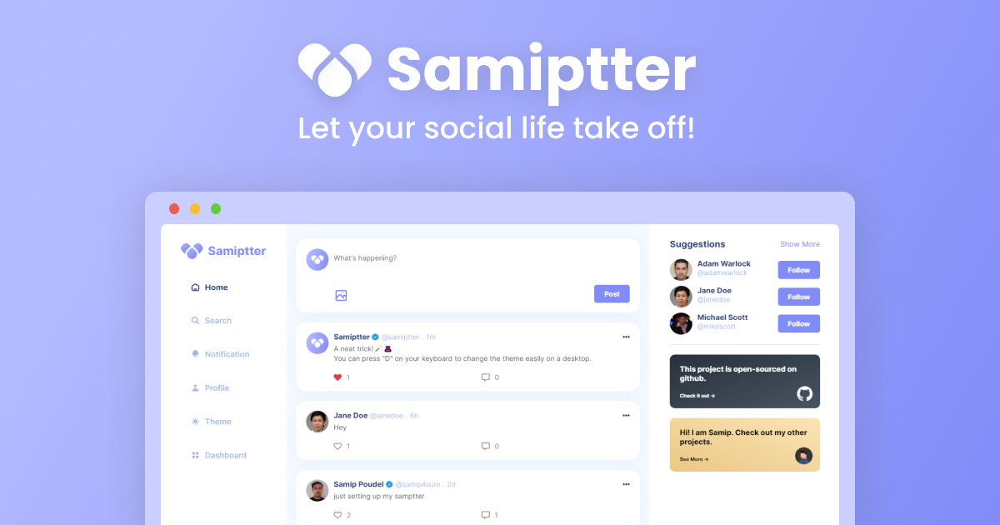

<a href="https://samiptter.herokuapp.com/">
    
  </a>

  <h2 align="center">Samiptter | The Ultimate Social Media Site</h2>

  <p align="center">The ultimate social media site of your dreams | Let your social life take off!</p>

  <p align="center">
    <a href="https://samiptter.herokuapp.com/">View Demo</a>
    ·
    <a href="https://github.com/SamipPoudel58/samiptter/issues">Report Bug</a>
    ·
    <a href="https://github.com/SamipPoudel58/samiptter/issues">Request Feature</a>
  </p>

## 🌟 Features

- Secure user registration and authentication
- Create posts, like and comment on posts
- Visit user profiles/follow other users
- Search for tweets with specific keywords

## ⚙️ Tech Stack

- React + Redux
- Sass
- Node.js
- MongoDB

## 🙏 Contributing

I'd love if you'd contribute to the project.

After cloning & setting up the local project you can push the changes to your github fork and make a pull request.

### Pushing the changes

```bash
git add .
git commit -m "feat: added new stuff"
git push YOUR_REPO_URL BRANCH_NAME
```

## 🚀 Local Development

Work In Progress...
